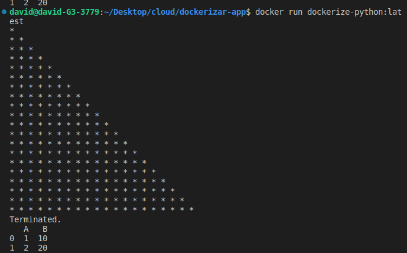
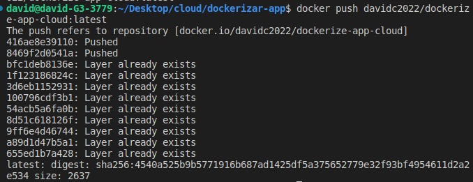

## Para correr el contenedor:
Pull a la imagen:
```
docker pull davidc2022/dockerize-app-cloud:latest
```

Para correr el contenedor ejecutar el comando: 
```
docker run dockerize-python:latest
```

## Prueba de funcionamiento 


## Imagen en dockerhub
https://hub.docker.com/repository/docker/davidc2022/dockerize-app-cloud


